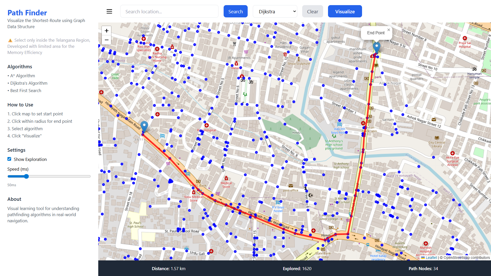
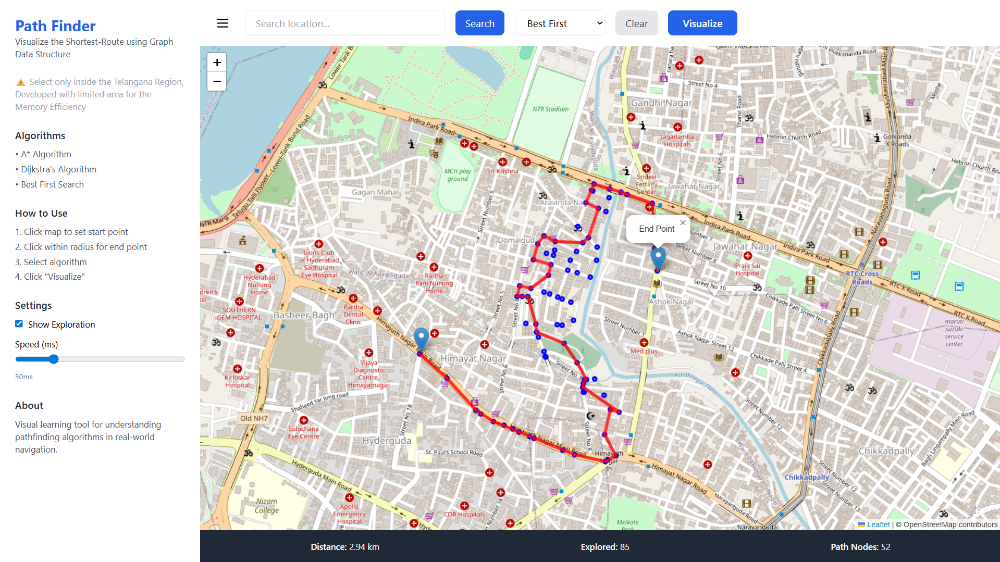

# PathFinding Visualizer Documentation
### Project Overview
It is an educational application that visualizes pathfinding algorithms on real-world maps. It allows users to see how different algorithms (Best First Search, A*, Dijkstra) explore nodes and find optimal paths between two points.

## Screenshots
- Using **Dijkstra** Algorithm
  


- Using **Best First Search** Algorithm
  

  
#### Tech Stack:
- **Backend:** Java 17, Spring Boot 3.x
- **Frontend:** HTML5, JavaScript, Leaflet.js, Tailwind CSS
- **Map Data:** OpenStreetMap (OSM)

#### Prerequisites
**Backend Requirements**
- Java 17 or higher
- Maven 3.6+
- Internet connection (for OSM data)

**Frontend Requirements**
- Modern web browser (Chrome, Firefox, Safari, Edge)
- Internet connection (for map tiles)

### Installation
1. Clone or Create Project Directory
    ```angular2html
       git clone https://github.com/siddharthramagiri/pathfinder.git
       cd pathfinder-main
    ```
2. Setup
    ```angular2html
    directory/
    ├── data/
    │   └── telangana-latest.osm.pbf
    ├── graph-cache/ (cache of Map data to reduce computation)
    ├── src/
    │   └── main/
    │       ├── java/com/map/pathfinder/
    │       │   ├── PathfinderApplication.java
    │       │   ├── config/
    │       │   │   └── CorsConfig.java
    │       │   ├── controller/
    │       │   │   └── PathfindingController.java
    │       │   ├── service/
    │       │   │   └── PathfindingService.java
    │       │   ├── algorithm/
    │       │   │   ├── AStarAlgorithm.java
    │       │   │   ├── DijkstraAlgorithm.java
    │       │   │   ├── BestFirstSearchAlgorithm.java
    │       │   │   └── PathResult.java
    │       │   ├── model/
    │       │   │   ├── Graph.java
    │       │   │   ├── Node.java
    │       │   │   └── Edge.java
    │       │   └── dto/
    │       │       ├── PathRequest.java
    │       │       ├── PathResponse.java
    │       │       └── Coordinate.java
    │       └── resources/
    │           └── application.properties
    │           └── static/
    │               └── index.html (Frontend File)
    │
    └── pom.xml
    ```

3. Start Application
    ```angular2html
    mvn clean install
    mvn spring-boot:run
    ```
   
4. Open Link
    ```
       http://localhost:8080/index.html
    ```
   