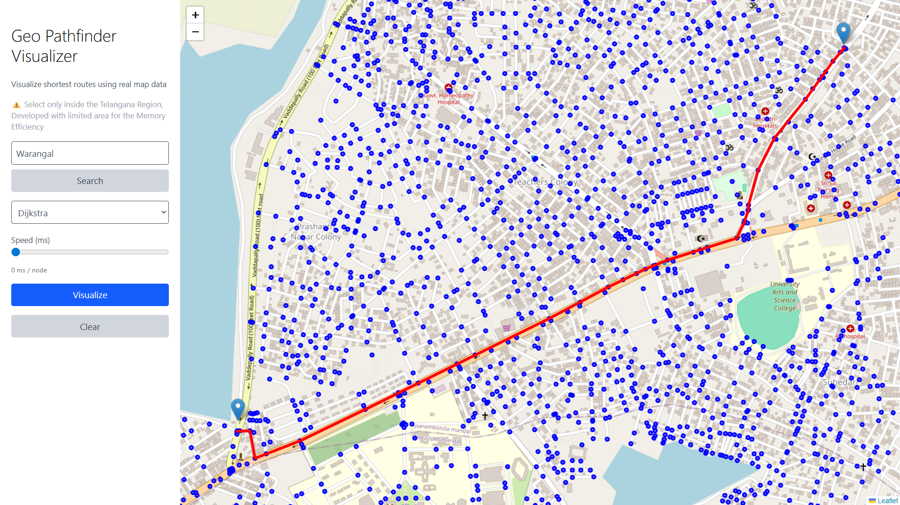
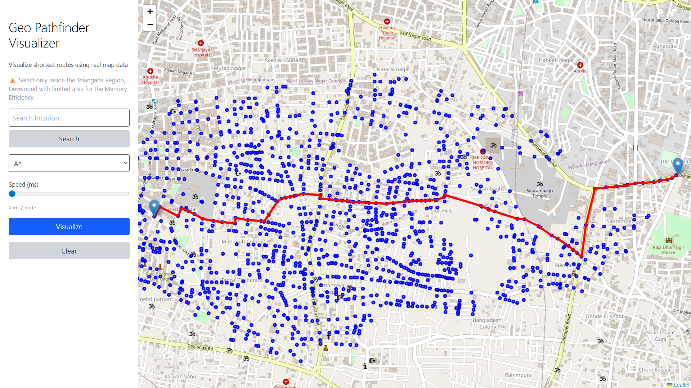

# Geographic PathFinding Visualizer Documentation
[Live Link](https://geo-pathfinder-frontend.vercel.app/)
### Project Overview
**Geo PathFinder** is a full-stack, real-time geographic pathfinding platform that visualizes classical graph algorithms on real-world maps and enables **live collaboration between users inside rooms**.

## Screenshots
- Using **Dijkstra** Algorithm
  


- Using **A-Star** Algorithm
  


Users can:

* Visualize **A***, **Dijkstra**, and **Best-First Search** algorithms on OpenStreetMap data
* Create and join rooms
* Share paths and locations **in real time**
* Scale real-time events using **Apache Kafka**
* Chat and collaborate using **WebSockets**

The project is designed with **production-grade architecture**, focusing on performance, scalability, and clean system design.

---


### Production Ready

* Spring Boot 3 + Java 17
* Next.js frontend
* Postgres SQL Database to manage rooms 
* Deployed on **AWS EC2**

---

---

## Tech Stack

### Backend

* **Java 17**
* **Spring Boot 3.x**
* **Spring WebSocket**
* **Apache Kafka**
* **GraphHopper (OSM data)**
* **Docker**

### Frontend

* **Next.js (App Router)**
* **TypeScript**
* **Leaflet.js**
* **Tailwind CSS**

### Infrastructure

* **AWS EC2**
* **Docker**
* **Encrypt (HTTPS)**

---

## Project Structure

```
project-root/
├── data/
│   └── telangana-latest.osm.pbf
│
├── graph-cache/
│   └── (cached map/graph data)
│
├── src/
│   └── main/
│       ├── java/
│       │   └── com/map/pathfinder/
│       │       ├── PathfinderApplication.java
│       │       │
│       │       ├── algorithm/
│       │       │   ├── Algorithm.java
│       │       │   ├── AlgorithmFactory.java
│       │       │   ├── AStarAlgorithm.java
│       │       │   ├── BestFirstSearchAlgorithm.java
│       │       │   └── DijkstraAlgorithm.java
│       │       │
│       │       ├── config/
│       │       │   └── WebSocketConfig.java
│       │       │
│       │       ├── controller/
│       │       │   ├── ChatController.java
│       │       │   ├── PathfindingController.java
│       │       │   ├── PublicController.java
│       │       │   └── RoomController.java
│       │       │
│       │       ├── dto/
│       │       │   ├── Coordinate.java
│       │       │   ├── PathRequest.java
│       │       │   ├── PathResponse.java
│       │       │   ├── PathResult.java
│       │       │   └── roomDto/
│       │       │       ├── CreateRoomRequest.java
│       │       │       └── JoinRoomRequest.java
│       │       │
│       │       ├── model/
│       │       │   ├── ChatMessage.java
│       │       │   ├── Edge.java
│       │       │   ├── Graph.java
│       │       │   ├── Location.java
│       │       │   ├── Node.java
│       │       │   └── Room.java
│       │       │
│       │       ├── repository/
│       │       │   ├── ChatMessageRepository.java
│       │       │   ├── LocationRepository.java
│       │       │   └── RoomRepository.java
│       │       │
│       │       └── service/
│       │           ├── ChatService.java
│       │           ├── KafkaConsumerService.java
│       │           ├── KafkaProducerService.java
│       │           ├── PathfindingService.java
│       │           └── RoomService.java
│       │
│       └── resources/
│           └── application.properties
│
├── pom.xml
└── README.md

```

---

## 🔧 Prerequisites

### Backend

* Java 17+
* Maven 3.8+
* Docker
* OSM `.pbf` map file

### Frontend

* Next.js 18+
* npm / pnpm

---

## Backend Setup

### Clone Repository

```bash
git clone https://github.com/siddharthramagiri/geo-pathfinder.git
cd geo-pathfinder/backend
```

### Environment Variables

```env
DATASOURCE_URL={DATABASE_URL}
DATASOURCE_USERNAME={DATABASE_USERNAME}
DATASOURCE_PASSWORD={DATABASE_PASSWORD};
OSM_FILE_PATH=/data/telangana.osm.pbf
GRAPH_CACHE_PATH=/graph-cache
```

### Run Backend

```bash
mvn clean package -DskipTests
java -jar target/app.jar
```

Backend runs on:

```
http://localhost:8080
```

---

## Learning Outcomes

* Implemented graph algorithms on real geographic data
* Designed scalable real-time systems using **Kafka**
* Built WebSocket-based collaboration features
* Deployed and secured applications with HTTPS on **AWS EC2 Instance**
* Optimized memory-heavy graph processing
* Designed production-ready backend/frontend separation

